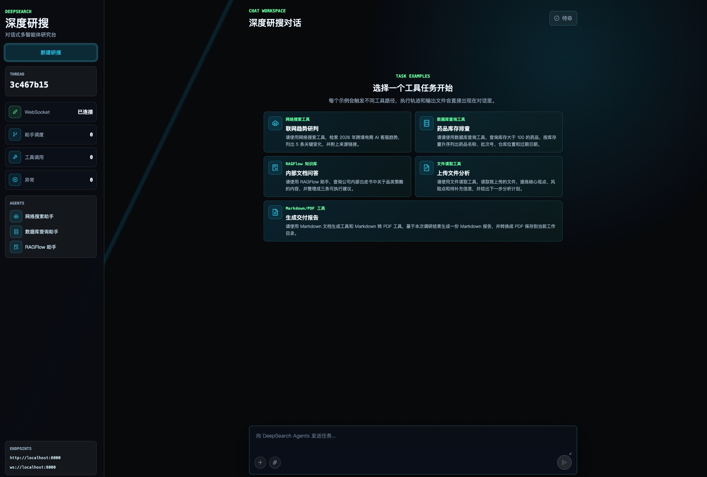
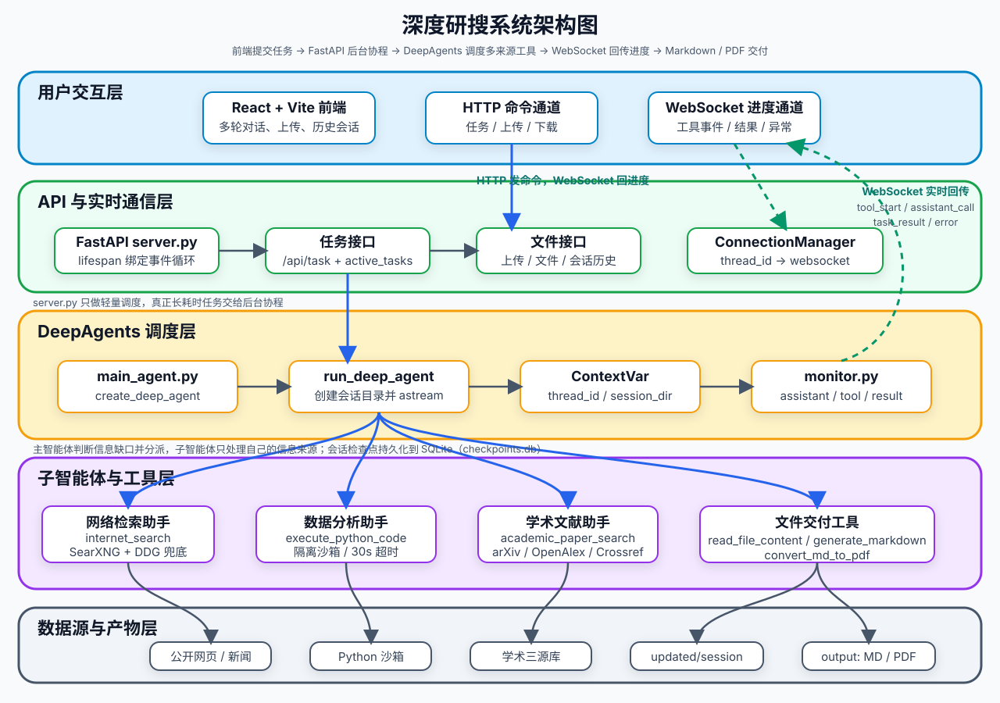
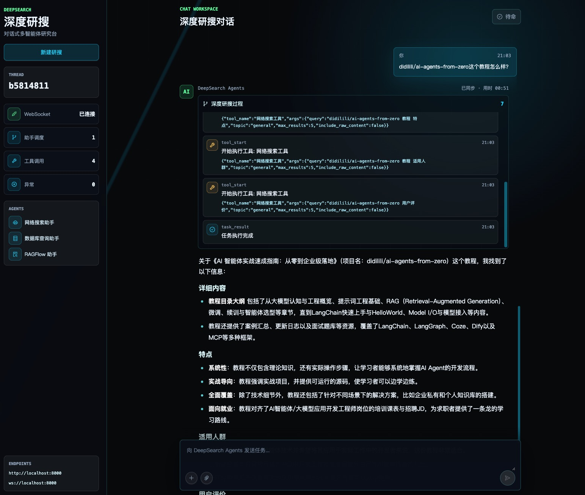

<div align='center'>
  <h1 style="margin-top: 15px;">「深度研搜」对话式多智能体研究系统</h1>
  <h4><b>deepsearch-agents</b></h4>
  <p><em>可能是全网最适合用于系统学习 DeepAgents 的多智能体深度研究实战项目，配套系统性文字教程与对应章节分支，带你打通主智能体调度、专家助手分工、多来源检索、文件交付与前后端实时联动全链路</em></p>
</div>

<div align='center'>


[](https://didilili.github.io/ai-agents-from-zero/#/%E5%AE%9E%E6%88%98%E9%A1%B9%E7%9B%AE-%E6%B7%B1%E5%BA%A6%E7%A0%94%E6%90%9C/0-%E5%89%8D%E8%A8%80)

</div>

**📢 说明**：本套实战项目已于 2026 年 5 月 17 日 更新完成，配套教程、章节分支和前后端代码均可对照学习。

如果你正在找一个适合学习 `DeepAgents`、`WebSocket`、`Tavily`、`RAGFlow` 和 AI Agent 工程开发的实战项目，「深度研搜」很可能是最适合你的项目。

它不是只调用一次大模型接口，也不是套一个搜索 API 做问答演示。这个项目围绕深度研究场景，用 DeepAgents 组织主智能体和专家子智能体，让系统可以根据任务需要查公开网络、查结构化数据库、查 RAGFlow 私有知识库、读取用户上传附件，并把最终结果整理成回答、Markdown 或 PDF。换句话说，你学到的不是某一个框架 API，而是一条 AI 应用从多智能体规划、工具接入、上下文隔离、接口交付到前端联调的完整项目主线。

> 📌 **当前本地版本的能力构成**（与上文上游介绍略有出入，以下方为准）：
> 三个子智能体是**网络检索**（SearXNG + DuckDuckGo）、**学术文献**（arXiv + OpenAlex + Crossref）、
> **数据分析**（Python 沙箱），主智能体另握上传文件读取与 Markdown/PDF 交付工具。
> 上游的「结构化数据库查询（MySQL）」助手已移除，「RAGFlow 私有知识库」降级为未接线的可选能力。
> 详见顶部「🧭 本地版本运行指南」与「🏗️ 系统架构」。

> 本套仓库是 [ai-agents-from-zero](https://github.com/didilili/ai-agents-from-zero) 教程体系中的 [实战项目-深度研搜](https://github.com/didilili/ai-agents-from-zero/tree/main/%E5%AE%9E%E6%88%98%E9%A1%B9%E7%9B%AE-%E6%B7%B1%E5%BA%A6%E7%A0%94%E6%90%9C) 配套源码仓库，除了可直接运行和二次开发的项目代码之外，也提供了与教程章节对应的 Git 分支演进过程，以及完整的在线图文讲义入口。
> 如果你想系统学习「AI 智能体 大模型应用开发」，也可直接从系统教程 [AI 智能体实战速成指南-大模型入门](https://didilili.github.io/ai-agents-from-zero/#/) 开始。



## 🧭 本地版本运行指南（2026-09 当前现状，优先阅读）

> 本仓库在上游教程项目基础上做了本地化改造，**实际运行方式与上游原始设计（Tavily + MySQL + RAGFlow、8000 端口、`frontend/` + pnpm + uv）差异很大**。要在本机把系统跑起来，请以本节为准。
>
> ⚠️ 上游教程正文（下方「📖 项目介绍」之后的章节）中涉及的 `frontend/`（Ant Design 前端）、
> `docker/`（MySQL 教学库）、`examples/`（教程脚本）、`docs/knowledge_base/`（RAGFlow 示例 PDF）
> **已于 2026-09-20 从仓库清理**，均不被主链路引用；在用的前端是同级目录 `../frontend-demo/`。
> 教程中关于 `uv sync` / `uv.lock` / `pnpm` 的步骤同样不再适用（本项目用 pip + venv、npm）。
> 阅读下文教程章节时请把它们当作「上游原始设计说明」，**不要照着执行**；
> 需要动手时一律回到本节和「🚀 接口与示例任务」。

### 三个同级目录

```text
Agent/
├── deepsearch-agents/   # 后端：FastAPI + DeepAgents（本目录），端口 8001
├── frontend-demo/       # 前端：React 19 + Vite + TypeScript，端口 5173
└── searxng/             # 元搜索：WSL2 Docker 部署的 SearXNG，端口 8888
```

### 当前能力与技术选型（与上游的差异）

| 能力 | 上游教程 | 本地当前版本 |
| --- | --- | --- |
| 大模型 | 通义 Qwen | **DeepSeek**（OpenAI 兼容端点，模型 `deepseek-flash`），见 `.env` |
| 网络检索 | Tavily（付费 Key） | **自建 SearXNG**（WSL2 Docker，免费聚合）为主，DuckDuckGo(`ddgs`) 为降级；带检索预算（每任务 3 次）与熔断 |
| 学术检索 | — | **arXiv + OpenAlex + Crossref** 三源并发、跨源去重、按引用/年份排序（OpenAlex 可选配免费 Key） |
| 数据分析 | MySQL 业务库 | **Python 沙箱**：预装 numpy / pandas / matplotlib / scipy / openpyxl / Pillow，可现场生成图表与数据文件 |
| 会话记忆 | InMemorySaver | **LangGraph SQLite 检查点**，刷新页面可恢复同一会话 |
| 私有知识库 | RAGFlow | 代码保留为未接线的休眠 demo，主链路不依赖 |
| Tavily / MySQL | 使用 | 已从主链路与 `requirements.txt` 移除 |

### 启动步骤（本机）

1. **启动 SearXNG（WSL2 + Docker）**

   在 WSL Ubuntu 内执行：

   ```bash
   cd searxng   # 进入项目根下的 searxng/ 目录
   bash deploy.sh          # 首次部署 / 更新配置后重建
   ```

   Windows 侧通过 `http://localhost:8888` 访问。后端会自动在“HTTP 直连”与
   “`wsl_query.sh` WSL 桥接”两种通道间选择（`SEARXNG_TRANSPORT=auto`）。

   > **WSL 空闲关停保活**：WSL2 在最后一个 wsl 会话退出后可能整体关停 distro，
   > 导致 Docker 与 SearXNG 冷启动（约 10–15 秒）。需要长时间挂机演示时，在 Windows
   > PowerShell 中运行保活脚本（隐藏常驻，自动拉起 docker 与容器）：
   >
   > ```powershell
   > Start-Process wsl -WindowStyle Hidden -ArgumentList '-d','Ubuntu-20.04','--','bash','<项目根目录>/searxng/keep_wsl_alive.sh'
   > ```
   >
   > 脚本注释里附有“Windows 任务计划登录时自启”的命令，可做开机持久化。

   > **引擎说明（国内网络）**：`searxng/settings.yml` 默认启用 Bing（走 `cn.bing.com`）、
   > Yandex、搜狗、360；显式禁用了在本机代理 TUN 网络下 DNS 污染 / 超时 / 触发验证码的
   > Google、DuckDuckGo、Brave、Wikipedia、百度。**配好出网代理后**可在 settings.yml
   > 重新启用 Google 等引擎并 `bash deploy.sh` 重建。

2. **配置后端环境变量**

   ```bash
   cp .env.example .env
   ```

   至少填写 `OPENAI_API_KEY`（DeepSeek Key）；`OPENALEX_API_KEY` 可选（避免共享 IP 触发 429）；
   SearXNG 相关变量默认值已可用，一般无需修改。

3. **安装 / 同步后端依赖**

   ```bash
   # 项目实际使用 pip + venv（未安装 uv，uv.lock 已移除）
   pip install -r requirements.txt
   ```

   > 可选能力：需要 RAGFlow 知识库时，再执行 `pip install ragflow-sdk` 并在 `.env`
   > 配置 `RAGFLOW_API_KEY` / `RAGFLOW_API_URL`；主链路不依赖它。

4. **启动后端（端口 8001）**

   ```bash
   # Windows PowerShell（venv 已建好）
   .\.venv\Scripts\python.exe -m uvicorn app.api.server:app --host 0.0.0.0 --port 8001
   # 或：uv run uvicorn app.api.server:app --host 0.0.0.0 --port 8001
   ```

   接口文档：`http://localhost:8001/docs`。

5. **启动前端（端口 5173）**

   ```bash
   cd ../frontend-demo
   npm install        # 首次
   npm run dev
   ```

   打开 `http://localhost:5173`。前端 API/WS 地址在 `src/lib/config.ts` 中指向 `localhost:8001`。

### 数据分析沙箱的工程约束

- 单次代码执行 30 秒超时；每个会话 Python 工具调用硬上限 **12 次**（超限强制收敛），
  避免模型反复探测 / 重复出图陷入死循环。
- 每次执行结果会回传【工作目录】与【本次产物】文件清单，模型据此确认文件已落盘，无需再
  自行 `os.listdir` / `os.path.exists` 探测。
- 图表使用 Agg 后端、坐标轴默认英文以规避中文字体缺失。

### 测试与端到端回归

```bash
# 后端单元测试（在 deepsearch-agents 目录）
.\.venv\Scripts\python.exe -m pytest -q

# 端到端回归（需先启动后端与 SearXNG），走真实 HTTP + WebSocket：
.\.venv\Scripts\python.exe scripts\e2e_run.py 常识直答 "用一句话解释什么是光合作用"
.\.venv\Scripts\python.exe scripts\e2e_run.py 网络检索 "检索 Python 3.13 的主要新特性，带来源链接"
.\.venv\Scripts\python.exe scripts\e2e_run.py 数据分析 "用 Python 生成正态分布随机数并画直方图保存为 PNG"
.\.venv\Scripts\python.exe scripts\e2e_run.py 学术文献 "检索 4D Gaussian Splatting 的代表性论文"
```

四条标准回归用例：常识直答（0 工具）、网络检索（SearXNG，≤3 次）、数据分析（Python 沙箱出图）、
学术文献（三源论文）。

---

## 📖 项目介绍

在真实研究场景里，用户的问题经常不是一句普通问答可以解决的。

比如：

```text
结合公开资料和学术文献，整理一份某技术方向的研究综述，并生成 PDF。
```

这个任务背后可能包含多类动作：

- 判断需要公开网页、学术论文、数值计算还是本次上传的附件；
- 去互联网搜索最新新闻、技术动态、产品或行业资讯；
- 到 arXiv / OpenAlex / Crossref 检索论文，梳理研究现状与发展脉络；
- 在 Python 沙箱里做统计计算、数值分析并生成图表；
- 读取用户上传的 PDF、Word、Excel、Markdown 或文本文件；
- 汇总多来源信息，判断资料是否足够；
- 生成 Markdown 报告，并在需要时转换成 PDF；
- 把执行过程、最终结果和生成文件实时展示给前端。

所以「深度研搜」更像一个会分工、会查资料、会生成交付物的研究助手。用户只需要提出任务，系统会在后端组织一条可观察的多智能体执行链路。

```text
用户任务
  -> FastAPI 接口接收请求（thread_id 贯穿全链路）
  -> run_deep_agent 创建会话目录、复制上传附件、写入 ContextVar
  -> 主智能体分析任务并规划步骤
  -> 分派给网络检索助手 / 数据分析助手 / 学术文献助手
  -> 子智能体调用各自工具（检索预算与熔断在此层生效）
  -> 主智能体汇总多来源信息
  -> 调用文件工具生成 Markdown / PDF
  -> monitor 通过 WebSocket 按 thread_id 定向推送进度
  -> 前端按轮累积展示事件、答案和文件列表
  -> 会话检查点写入 SQLite，可在侧边栏历史会话中恢复
```

## ✨ 项目亮点

- **一主三从的多智能体架构**
  - 主智能体负责理解任务、规划步骤、调度助手和最终汇总。
  - 网络检索助手、数据分析助手、学术文献助手分别处理不同类型的信息需求。
- **多来源检索，而不是模型裸答**
  - `SearXNG`（自建元搜索，DuckDuckGo 兜底）负责互联网公开资料检索。
  - `arXiv + OpenAlex + Crossref` 三源负责学术论文检索。
  - Python 沙箱负责统计计算与可视化。
  - 上传附件由主智能体通过文件工具读取。
- **检索治理，而不是无限制地搜**
  - 每个会话的对外检索次数有硬预算（网页 3 次、学术 2 次），配合 LRU 缓存、
    熔断器与关键词重排序，既控制成本也避免模型反复搜索。
- **从检索到交付的完整可运行链路**
  - 不停留在 Prompt 设计，而是会真实调用工具、读取数据、生成 Markdown，并在需要时转换成 PDF。
- **长任务执行过程可观察**
  - 工具调用、子智能体调用、工作目录创建、任务结果、取消和异常都会通过 `monitor` 推送到前端。
- **会话级上下文隔离与持久化**
  - 通过 `thread_id` 和 `session_dir` 区分不同任务，`ContextVar` 让深层工具也能拿到当前会话身份和文件目录。
  - 会话检查点持久化到 SQLite，支持侧边栏历史会话列表与多轮问答恢复。
- **工程化前后端结构清晰**
  - 基于 `FastAPI + WebSocket + DeepAgents + React` 组织任务接口、异步执行、事件推送、文件上传和文件下载。
- **不仅有实战代码，还有完整配套教程文档**
  - 项目配有一套系统化、完全免费的教程讲义，适合按章节从 DeepAgents 基础、子智能体、Backend、中间件一直学到完整项目闭环。
- **兼顾学习价值与可扩展性**
  - 既可以按教程章节逐步理解，也可以在此基础上继续扩展权限控制、任务队列、事件持久化、评测体系等能力。

这套课程十分适合这些场景：

- 想系统学习 `DeepAgents`，但不想只停留在几个玩具示例。
- 想把网络检索、学术检索、代码沙箱和大模型放到同一个研究助手场景里理解。
- 想做一个比简单模型调用更接近真实开发的 AI Agent 项目。
- 想把项目写进简历，并且能说清楚智能体层、工具层、服务层、文件层和前端层分别做了什么。

## 🏗️ 系统架构



项目采用 DeepAgents 中典型的 Orchestrator-Workers 模式：主智能体作为调度中心，三个专家助手负责信息获取，文件工具由主智能体直接掌握。

项目围绕两条主线展开：

| 主线             | 做什么                                                       | 涉及模块                                                                  |
| ---------------- | ------------------------------------------------------------ | ------------------------------------------------------------------------- |
| 多智能体深度研搜 | 基于用户任务完成规划、分派、检索、读取附件、汇总和生成交付物 | `DeepAgents` / `LangChain` / `LangGraph` / `SearXNG` / 学术三源            |
| 前后端实时闭环   | 启动后台任务、上传文件、推送执行过程、展示结果和下载生成文件 | `FastAPI` / `WebSocket` / `React` / `Vite`                                |

### 智能体与工具

| 归属         | 能力                                       | 工具                                                          |
| ------------ | ------------------------------------------ | ------------------------------------------------------------- |
| 主智能体     | 任务规划、助手调度、结果汇总、文件交付     | `read_file_content`、`generate_markdown`、`convert_md_to_pdf` |
| 网络检索助手 | 查询互联网公开信息、新闻、技术动态与博客   | `internet_search`（SearXNG 为主，DuckDuckGo 兜底）            |
| 数据分析助手 | 编写并执行 Python 完成统计、计算与可视化   | `execute_python_code`（隔离沙箱，30 秒超时，每会话 ≤12 次）   |
| 学术文献助手 | 检索论文、梳理研究现状与发展脉络           | `academic_paper_search`（arXiv + OpenAlex + Crossref 三源）   |

> 上游教程中的「数据库查询助手」（MySQL）与「RAGFlow 助手」在当前后端**已不存在**：
> 前者被数据分析助手取代（教学假数据无实际价值），后者降级为未接线的可选能力
> （`app/ragflow/`，主链路不导入）。



## 🛠️ 项目技术栈

| 模块           | 技术                                             | 作用                                                                          |
| -------------- | ------------------------------------------------ | ----------------------------------------------------------------------------- |
| 智能体框架     | `DeepAgents` 0.5.7                               | 创建主智能体和子智能体，承接长任务、多工具、多助手调度                        |
| 图与检查点     | `LangGraph` + `langgraph-checkpoint-sqlite`      | 提供底层运行时；`AsyncSqliteSaver` 把会话检查点持久化到 `app/checkpoints.db`   |
| 模型与工具抽象 | `LangChain` / `langchain-core`                   | 封装 OpenAI 兼容模型、工具声明和 Agent 调用结构                               |
| 大模型接入     | `langchain-openai`（OpenAI 兼容接口）            | 通过 `.env` 的 `OPENAI_BASE_URL` / `OPENAI_API_KEY` 接入 DeepSeek 等模型      |
| 网络检索       | 自建 `SearXNG` + `ddgs`                          | SearXNG（WSL2 Docker，聚合多引擎）为主，DuckDuckGo 为降级；均免费无需 Key     |
| 学术检索       | `arXiv` / `OpenAlex` / `Crossref`                | 三源官方免费 API 并发检索、跨源去重、年份/引用排序（OpenAlex 可选配免费 Key） |
| 数据分析       | Python 子进程沙箱                                | 预装 numpy / pandas / matplotlib / scipy / openpyxl / Pillow，可现场出图      |
| 私有知识库     | `ragflow-sdk`（**可选，默认未安装**）            | 已改为延迟导入，未配置时不影响主链路运行                                      |
| 文件处理       | `pypdf` / `python-docx` / `pandas` / `ReportLab` | 读取上传附件，生成 Markdown，转换 PDF                                         |
| 后端接口       | `FastAPI` / `Uvicorn`                            | 提供任务、取消、上传、文件列表、下载、历史会话和 WebSocket 接口               |
| 实时通信       | `WebSocket`                                      | 推送工具调用、助手调用、最终结果和错误事件                                    |
| 前端           | `React` 19 / `Vite` / `TypeScript` / `Tailwind`  | 对话式研搜界面、多轮对话、事件流、附件上传、历史会话与文件下载                |
| 依赖管理       | `pip` + `venv`（后端）/ `npm`（前端）            | 未使用 uv 与 pnpm；`uv.lock` 已移除                                           |

## 📁 项目结构

```text
deepsearch-agents/
├── app/
│   ├── agent/
│   │   ├── subagents/              # 网络检索、数据分析、学术文献三个子智能体
│   │   ├── llm.py                  # OpenAI 兼容模型初始化
│   │   ├── main_agent.py           # 主智能体组装与 run_deep_agent 执行入口
│   │   └── prompts.py              # 读取 app/prompt/prompts.yml
│   ├── api/
│   │   ├── context.py              # ContextVar 保存 thread_id 和 session_dir
│   │   ├── monitor.py              # 工具调用、助手调用、结果和异常事件推送
│   │   ├── threads.py              # 历史会话列表与多轮问答还原（只读 SQLite）
│   │   └── server.py               # FastAPI 任务、上传、文件、下载、历史会话、WebSocket 接口
│   ├── prompt/
│   │   └── prompts.yml             # 主智能体和子智能体提示词配置
│   ├── ragflow/                    # RAGFlow 配置与示例（可选能力，延迟导入）
│   ├── tools/                      # SearXNG/DuckDuckGo 检索、arXiv/OpenAlex/Crossref
│   │                               # 学术检索、Python 沙箱、文件读取、Markdown、PDF 工具
│   ├── utils/                      # 路径解析、Markdown/PDF 底层转换等普通 Python 工具
│   ├── checkpoints.db              # 会话持久化数据库（AsyncSqliteSaver，历史会话数据源）
│   ├── output/                     # 运行时生成：每个会话的 Markdown、PDF 等产物
│   └── updated/                    # 运行时生成：用户上传文件的会话暂存目录
├── docs/images/                    # README 引用的截图与架构图
├── scripts/e2e_run.py              # 端到端回归脚本（真实 HTTP + WebSocket）
├── tests/                          # 测试目录（不依赖外网与大模型）
├── .env.example                    # 环境变量示例
├── pyproject.toml                  # Python 项目依赖声明
└── requirements.txt                # 依赖清单（ragflow-sdk 为可选，默认注释）
```

> 前端不在本目录内，位于同级目录 `../frontend-demo/`（React + Vite + Tailwind，npm 管理）。
>
> 2026-09-20 清理的内容：`frontend/`（上游 Ant Design 前端）、`docker/`（MySQL 教学库）、
> `uv.lock`（锁着已移除的 Tavily）、`examples/`（上游教程脚本，2 个引用已移除的 Tavily）、
> `docs/knowledge_base/`（RAGFlow 示例 PDF，该能力已降级为可选）。
> 以上均不被主链路引用，依赖管理实际使用 pip + venv。

## 🚀 接口与示例任务

> 启动步骤见本文顶部的「🧭 本地版本运行指南」，此处不再重复。

### 后端接口

后端地址 `http://localhost:8001`，接口文档 `http://localhost:8001/docs`。

| 接口                                | 说明                                                       |
| ----------------------------------- | ---------------------------------------------------------- |
| `POST /api/task`                    | 启动一次 DeepAgents 后台任务（`{query, thread_id}`）       |
| `POST /api/task/{thread_id}/cancel` | 取消指定会话任务                                           |
| `POST /api/upload`                  | 上传一个或多个文件到当前会话（multipart，含 `thread_id`）  |
| `GET /api/files?path=`              | 列出会话输出目录中的生成文件（限制在 `app/output` 内）     |
| `GET /api/download?path=`           | 下载输出目录中的文件                                       |
| `GET /api/threads?limit=`           | 历史会话列表（标题、时间、步数、产物目录）                 |
| `GET /api/threads/{thread_id}`      | 单个会话的多轮问答详情，用于点击历史会话后恢复             |
| `WebSocket /ws/{thread_id}`         | 推送工具调用、助手调用、结果和异常事件                     |

跨域白名单默认放行 `http://localhost:5173` 与 `127.0.0.1:5173`，
可用环境变量 `CORS_ORIGINS`（逗号分隔）覆盖。

### 前端连接配置

前端地址 `http://localhost:5173`，API/WS 地址在 `frontend-demo/src/lib/config.ts`
中默认指向 `localhost:8001`，也可用 `.env` 覆盖：

```bash
VITE_API_BASE_URL=http://localhost:8001
VITE_WS_BASE_URL=ws://localhost:8001
```

### 试几个任务

```text
用一句话解释什么是光合作用
```
> 常识直答，不派任何助手、秒回。

```text
检索 Python 3.13 的主要新特性，整理带来源链接的简短说明
```
> 路由到网络检索助手，走 SearXNG，检索预算 3 次。

```text
检索 2026 年自动驾驶方向多模态数据融合的最新进展和趋势
```
> 路由到学术文献助手，`academic_paper_search` 会带 `year_from` 做年份限定，
> 排序按年份优先，避免返回高被引的老论文。

```text
用 Python 生成 500 个均值 100 标准差 15 的正态分布随机数，画直方图保存为 PNG
```
> 路由到数据分析助手，沙箱出统计表 + PNG，结束后可在结果下方下载。

```text
（先用 📎 上传一个 CSV/PDF/DOCX）分析我上传的文件，总结要点
```
> 主智能体用 `read_file_content` 读取附件后作答。

```text
写一份 3DGS 发展历程的 PDF 给我
```
> 会先检索再用 `generate_markdown` + `convert_md_to_pdf` 产出可下载文件。

## 📚 配套教程目录

> ⚠️ 下表是**上游教程的原始章节**，其中第 10 章（Tavily 网络搜索）、第 11 章（MySQL 数据库助手）、
> 第 12 章（RAGFlow 知识库）所述的技术栈在本仓库已被替换或降级：
> 网络检索改为自建 SearXNG，数据库助手改为 Python 数据分析沙箱，RAGFlow 改为可选的未接线能力。
> 这些章节适合理解「上游原始设计与演进思路」，**不能照着在当前仓库执行**。

教程总入口：[深度研搜完整教程](https://didilili.github.io/ai-agents-from-zero/#/%E5%AE%9E%E6%88%98%E9%A1%B9%E7%9B%AE-%E6%B7%B1%E5%BA%A6%E7%A0%94%E6%90%9C/0-%E5%89%8D%E8%A8%80)

| 章节 | 标题                                                                                                                                   | 学习重点                                                      | 对应分支                              |
| ---- | -------------------------------------------------------------------------------------------------------------------------------------- | ------------------------------------------------------------- | ------------------------------------- |
| 0    | [前言](https://didilili.github.io/ai-agents-from-zero/#/实战项目-深度研搜/0-前言)                                                      | 项目定位、学习价值、技术栈和能力边界                          | `-`                                   |
| 1    | [DeepAgents 基础与核心概念](https://didilili.github.io/ai-agents-from-zero/#/实战项目-深度研搜/1-DeepAgents基础与核心概念)             | 智能体演进、框架定位、核心能力和多智能体设计边界              | `-`                                   |
| 2    | [DeepAgents 快速入门与流式解析](https://didilili.github.io/ai-agents-from-zero/#/实战项目-深度研搜/2-DeepAgents快速入门与流式解析)     | `create_deep_agent()`、`invoke`、`stream`、`chunk`            | `02-quickstart-streaming`             |
| 3    | [子智能体进阶与异步执行](https://didilili.github.io/ai-agents-from-zero/#/实战项目-深度研搜/3-子智能体进阶与异步执行)                  | 字典式子智能体、助手调度、`astream` 和嵌套边界                | `03-deepagents-subagents-async`       |
| 4    | [接入 LangGraph 与 LangChain](https://didilili.github.io/ai-agents-from-zero/#/实战项目-深度研搜/4-接入LangGraph与LangChain)           | `CompiledSubAgent`、LangGraph 子图、LangChain Agent 包装      | `04-deepagents-langgraph-langchain`   |
| 5    | [人机协作与中断恢复](https://didilili.github.io/ai-agents-from-zero/#/实战项目-深度研搜/5-人机协作与中断恢复)                          | 人工审批、编辑工具参数、中断和恢复执行                        | `05-deepagents-hitl-interrupt`        |
| 6    | [长期记忆与 Backend 存储](https://didilili.github.io/ai-agents-from-zero/#/实战项目-深度研搜/6-长期记忆与Backend存储)                  | `FilesystemBackend`、`StoreBackend`、`CompositeBackend`       | `06-deepagents-backends-memory`       |
| 7    | [中间件机制与 Skills 配置](https://didilili.github.io/ai-agents-from-zero/#/实战项目-深度研搜/7-中间件机制与Skills配置)                | 上下文摘要、模型调用限制、工具调用限制、自定义中间件和 Skills | `07-deepagents-middleware-governance` |
| 8    | [项目总览与工程初始化](https://didilili.github.io/ai-agents-from-zero/#/实战项目-深度研搜/8-项目总览与工程初始化)                      | 一主三从架构、9 个工具、前后端交互、工程目录                  | `09-deepsearch-core-config`           |
| 9    | [基础模块与模型配置](https://didilili.github.io/ai-agents-from-zero/#/实战项目-深度研搜/9-基础模块与模型配置)                          | `.env`、`ContextVar`、`monitor`、路径工具、模型和提示词配置   | `09-deepsearch-core-config`           |
| 10   | [网络搜索子智能体与 Tavily 工具](https://didilili.github.io/ai-agents-from-zero/#/实战项目-深度研搜/10-网络搜索子智能体与Tavily工具)   | `internet_search`、Tavily 配置、网络搜索助手组装和进度上报    | `10-deepsearch-network-subagent`      |
| 11   | [数据库查询子智能体与 MySQL 工具](https://didilili.github.io/ai-agents-from-zero/#/实战项目-深度研搜/11-数据库查询子智能体与MySQL工具) | 本地 MySQL、查表、预览数据、执行 SQL、数据库助手组装          | `11-deepsearch-database-subagent`     |
| 12   | [RAGFlow 子智能体与知识库准备](https://didilili.github.io/ai-agents-from-zero/#/实战项目-深度研搜/12-RAGFlow子智能体与知识库准备)      | RAGFlow 部署、助手列表查询、临时会话问答、知识库助手组装      | `12-deepsearch-ragflow-subagent`      |
| 13   | [主智能体搭建与异步执行](https://didilili.github.io/ai-agents-from-zero/#/实战项目-深度研搜/13-主智能体搭建与异步执行)                 | 主智能体组装、上传文件读取、Markdown/PDF 工具、会话目录隔离   | `13-deepsearch-main-agent`            |
| 14   | [FastAPI 接口与项目闭环](https://didilili.github.io/ai-agents-from-zero/#/实战项目-深度研搜/14-FastAPI接口与项目闭环)                  | 任务启动/取消、上传、文件列表、下载、WebSocket 和前端联调     | `14-deepsearch-api-websocket`         |

可以用分支切换对照每一阶段的代码演进：

```bash
git checkout 10-deepsearch-network-subagent
git checkout main
```

`main` 分支保留当前完整闭环版本。

## 🚧 能力边界

「深度研搜」适合入门到进阶阶段学习多智能体工程主链路，但它不是一个完整企业级生产系统。当前版本重点覆盖 DeepAgents 多智能体调度、真实工具接入、文件交付、FastAPI 接口、WebSocket 实时推送和前后端联调。

**当前已具备**（2026-09-20 起）：

- 会话持久化：SQLite 检查点，刷新页面恢复同一会话；
- 历史会话列表与多轮问答恢复：侧边栏展示真实会话，点击可还原问答与产物；
- 多轮对话累积：同一会话内连续提问，历史轮次不被覆盖；
- 文件上传闭环：前端附件入口 → 会话暂存 → 复制到工作目录 → 工具读取 → 产物下载；
- 检索治理：会话级检索预算、LRU 缓存、熔断器、关键词重排序。

它没有刻意展开以下生产治理能力：

- 用户登录、角色权限和多租户隔离；
- 文件上传安全扫描和内容审核；
- 任务队列、分布式执行和大规模并发治理；
- 全量事件持久化与审计追踪（当前只持久化会话检查点，执行事件不落库）；
- 会话产物的自动清理策略（`app/output/session_*` 会持续累积）；
- 系统化评测集、自动化回归和 Agent 质量评估；
- 生产监控、告警、链路追踪和灰度发布；
- 复杂报告编辑、协同工作流和权限化文件管理。

这些能力适合在主链路跑通之后继续扩展。本仓库先承担一个清晰角色：把 DeepAgents 多智能体项目最关键、最必要、最值得学习的工程骨架讲清楚、跑起来，并为后续企业级扩展打基础。
